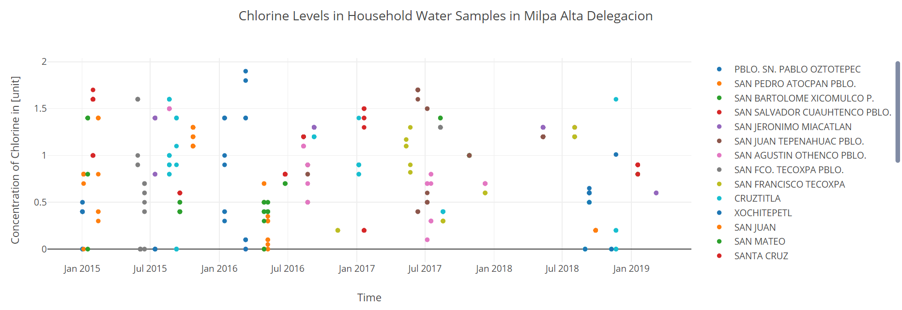

# Mexico City Water Quality Application

Sabah Pirani

[Link to this repository](<https://github.com/Sabah-pirani/Mexico_City_Chlorine_Levels_Application>)

---

## Project Description

The water infrastructure department of the Mexican government (Sistmas de Aguas de Cuidad de Mexico) provides data on the chlorine levels of water samples it collects throughout Mexico City. The data is hosted online at: http://data.sacmex.cdmx.gob.mx/aplicaciones/calidadagua/ . While the database being used to store the data by the government includes dates of sample collection as evidenced by the ability to query the data by date, the date isn't displayed on the website. Furthermore the data is organized such that you must pick a region, then a neighborhood to view the data for ~10 samples and then go back to view any data from a different neighborhood or region. Ultimately, the User interface for the data is poorly designed making it nearly impossible for researchers to make use of this data that is being collected by the government. 

This application includes a script to query the data from the site and store the data with a date and full information about the location (region, neighborhood and street) in a database. The application provides a very simplistic User Interface to query the data and conduct exploratory data analysis. 

The project will be expanded to include visual mapping of the regions with the ability to download CSV files of the data that one is interested in, in the future. 

## How to run

1.  Create a Virtual Environment. Instructions for doing so can be found here: <https://packaging.python.org/guides/installing-using-pip-and-virtual-environments/>. Note that the instructions differ depending on if you are using a Mac or PC machine. 

2. Obtain all the libraries necessary to run the project using the requirements.txt file. In the directory in which the files are saved run `pip install -r requirement.txt` in the command line. 

3. There are two ways in which this application is intended to be used:

   1. The database file provided in the repository has data from 01-01-2015 until 4-24-2019. If you simply wish to query the data provided within the provided database file you may simply run the main_app.py file on your command line. Then open any web browser and navigate to your local server address (often ` http://localhost:5000/`). This page will have an introduction and links to other pages that allow you to query the database and view visualizations. The code for the command line would look as follows: 

      `python main_app.py`

   2. If you are trying to update the db file to include the data from 4-24-2019 onward or prior to  01-01-15 . You first must edit the 'start_date', and 'end_date' variables on line 92 and 93 of the scrape_data_populate_db.py file. Select the dates for which you want data to be scraped from the site. Do not worry about overlapping dates, the script accounts for and ensures duplicate data is not collected.  Save the file and run the scrape_data_populate_db.py file on your command line with the following command: 

      `python scrape_data_populate_db.py`

## How to use:

Main Page: The main page provides an overview of the data source. There is a link that allows you to see all the data visualized on one graph (color coded by region) and another that allows you to select the region for which you may want to see data.

/all_data: Below is a view of all the data on one plot. The right side allows for breaking down the data by region, you may click on the region name and it will be removed from or added to the graph depending on its prior state. It is clear that there are outlying points. Efforts to clean the data and explore reason why such outliers exist will be pursued in the continuation of this project. 

/<delegacion_name>: When selecting delegacion name 

## Routes in this application

- `/` -> this is the home page which has some background on the project as well as links to the all_data visualization as well as a dropdown to select a region for which you can view data
- `/all_data` -> this route has a scatter plot visualization with delegaciones (regions) color coded 
- `/<delegacion_name>` -> this route will have a scatter plot with the data for the delegacion (region) selected. The markers are color coded by neighborhood

## How to run tests
1. First... (e.g. access a certain directory if necessary)
2. 

## In this repository:

- README.md
- main_app.py
- scrape_data_populate_db.py
- calidad_agua.db
- requirements.txt
- database_schema.png
- templates/index.html
- templates/delegaciones.html
- test_mexico_project.py

---
## Acknowledgments

This project was built in part for SI507 class and a great deal of support was provided by the class' instructional team. Some configuration settings among other smaller snippets of code are directly copied from examples used in SI507 and are attributed to Jackie Cohen (jczetta). The graduate student instructors provided help in debugging and conceptualizing the relationships between different parts of the project which was also immensely helpful. 

## Code Requirements for Grading

Please check the requirements you have accomplished in your code as demonstrated.
- [x] This is a completed requirement.
- [ ] This is an incomplete requirement.

Below is a list of the requirements listed in the rubric for you to copy and paste.  See rubric on Canvas for more details.

### General
- [x] Project is submitted as a Github repository
- [x] Project includes a working Flask application that runs locally on a computer
- [ ] Project includes at least 1 test suite file with reasonable tests in it.
- [x] Includes a `requirements.txt` file containing all required modules to run program
- [x] Includes a clear and readable README.md that follows this template
- [x] Includes a sample .sqlite/.db file
- [x] Includes a diagram of your database schema
- [x] Includes EVERY file needed in order to run the project
- [x] Includes screenshots and/or clear descriptions of what your project should look like when it is working

### Flask Application
- [x] Includes at least 3 different routes
- [x] View/s a user can see when the application runs that are understandable/legible for someone who has NOT taken this course
- [x] Interactions with a database that has at least 2 tables
- [x] At least 1 relationship between 2 tables in database
- [x] Information stored in the database is viewed or interacted with in some way

### Additional Components (at least 6 required)
- [x] Use of a new module (plotly)
- [x] Use of a second new module (unidecode)
- [ ] Object definitions using inheritance (indicate if this counts for 2 or 3 of the six requirements in a parenthetical)
- [ ] A many-to-many relationship in your database structure
- [x] At least one form in your Flask application
- [x] Templating in your Flask application
- [x] Inclusion of JavaScript files in the application
- [x] Links in the views of Flask application page/s
- [ ] Relevant use of `itertools` and/or `collections`
- [x] Sourcing of data using web scraping
- [ ] Sourcing of data using web REST API requests
- [ ] Sourcing of data using user input and/or a downloaded .csv or .json dataset
- [x] Caching of data you continually retrieve from the internet in some way

### Submission
- [x] I included a link to my GitHub repository with the correct permissions on Canvas! (Did you though? Did you actually? Are you sure you didn't forget?)
- [x] I included a summary of my project and how I thought it went **in my Canvas submission**!
